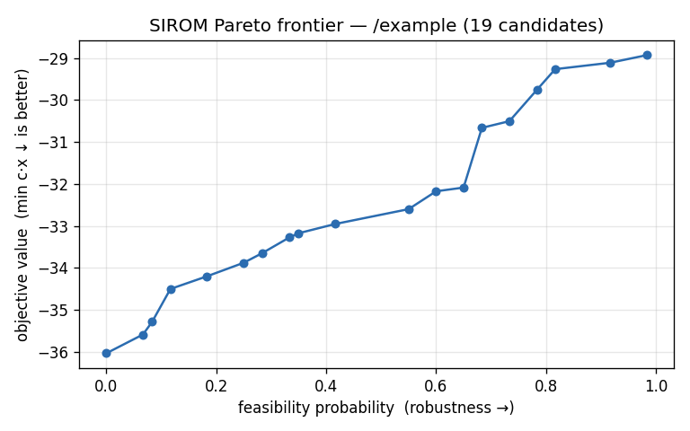

# SIROM demo — robust portfolio optimization

A small, pretty web app that uses SIROM to build investment portfolios under
**uncertain returns**. It's a worked example of putting a real decision problem
on top of SIROM.



## The idea

Each asset's expected return isn't a single number — it's a range. The app
asks SIROM for the **minimum-risk allocation that meets a target return**, where
the returns are uncertain, and gets back a Pareto frontier:

> spend more **risk** → raise the **probability of actually hitting your target**.

Click any point on the frontier to see that portfolio's allocation.

### The model (a robust LP SIROM solves)

```
minimize    Σ riskᵢ · xᵢ            portfolio risk
subject to  Σ xᵢ ≤ 1               budget (cash allowed)
            Σ rᵢ · xᵢ ≥ target      return floor, rᵢ ∈ [low, high]  ← uncertain
            xᵢ ≤ capᵢ              per-asset cap
            xᵢ ≥ 0
```

Only the return-floor row is uncertain; SIROM samples it, solves each future,
clusters the optimal portfolios, and scores how often each one meets the target.

## Run it

```bash
pip install -e ".[api]"
uvicorn demo.app:app --port 8800
# open http://localhost:8800
```

Adjust the **target return** and **number of futures** sampled, toggle assets on
and off, then **Build portfolios** and explore the frontier.

## How it's wired

- `demo/portfolio.py` — turns assets + target into a `SolveRequest` and calls
  `sirom.api.service.solve_problem` in-process.
- `demo/app.py` — FastAPI: serves the page and a `POST /optimize` endpoint.
- `demo/static/index.html` — the single-page UI (Plotly + vanilla JS).
