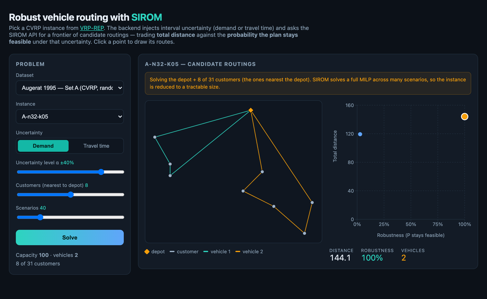

# SIROM demo — robust vehicle routing from VRP-REP

A second worked example for SIROM (the first is `demo/`, robust portfolios).
This one picks a **real CVRP instance from [VRP-REP](http://www.vrp-rep.org/datasets.html)**,
turns it into a **robust** vehicle routing problem, and solves it by talking to
the **SIROM HTTP API over the network** — a "SIROM-as-a-service" demo that runs
entirely in Docker.



## The idea

VRP-REP instances are *deterministic*. SIROM exists to handle *interval
uncertainty*. So the demo injects synthetic uncertainty around each instance's
nominal values and asks SIROM for a **Pareto frontier of candidate routings**:

> spend more **distance** → raise the **probability the plan stays feasible**.

Two uncertainty modes (toggle in the UI):

| Mode | What varies | Where it lands in `min c·x s.t. A·x ≤ b` | Robustness means |
|------|-------------|------------------------------------------|------------------|
| **Demand** | each customer demand `dⱼ ∈ [qⱼ(1−α), qⱼ(1+α)]` | the RHS `b` (capacity / MTZ-load) | P(routes stay within vehicle capacity) |
| **Travel time** | each arc time `τᵢⱼ ∈ [dᵢⱼ(1−α), dᵢⱼ(1+α)]` | the matrix `A` (time-MTZ chain) | P(every route finishes within the shift) |

The model is an arc-based CVRP with Miller–Tucker–Zemlin subtour elimination
(`backend/cvrp.py` documents it in full).

## Datasets

The catalog (`backend/vrprep.py`) covers the **coordinate-based CVRP datasets**
on VRP-REP, downloaded on demand:

| Dataset | Character | Smallest instance |
|---------|-----------|-------------------|
| **Augerat Set P** | tiny capacity → trade-off bites even at low α | `P-n016-k08` (15 cust.) |
| **Augerat Set A** | random coordinates & demands | `A-n32-k05` (31) |
| **Augerat Set B** | clustered coordinates | `B-n31-k05` (30) |
| **Fisher Set F** | real-geography-style | `F-n045-k4` (44) |
| **Christofides CMT** | classic mixed instances | `CMT01` (50) |
| **Christofides Set M** | larger classic | `M-n101-k10` (100) |
| **Uchoa et al. 2014** | the modern *X* benchmark (100 instances) | `X-n101-k25` (100) |
| **Golden Set 1** | large-scale | `Golden_01` (240) |
| **Li et al. 2005** | very large-scale | `Li_21` (560) |
| **VeRoLog Members** | very large-scale | `VeRoLogV12_15` (828) |
| **VeRoLog Members 2016** | very large-scale | `VeRoLogV08_16` (1068) |

These are every coordinate-based CVRP dataset on VRP-REP. Other variants (VRPTW,
PDPTW, VRPSD, MDVRP, …) are out of scope — this demo's model is capacitated
routing only. The Christofides–Eilon **Set E** and the **Belgium** sets are
excluded too: they specify distances with an explicit matrix instead of node
coordinates, which the map can't display (the parser returns a clear message if
such an instance is ever selected). The depot is found via the fleet's
departure node (Uchoa marks it that way, not with a `type 0` node). Large
datasets still solve fine — every instance is subsampled to the depot + the K
nearest customers first.

Each dataset's instances are listed **lazily from its zip** (smallest first), so
adding a dataset is a single `DatasetInfo(slug, title, "CVRP")` line in
`backend/vrprep.py` — no instance names to maintain. Tighter instances (Set P)
show a richer frontier at lower α; loosely-loaded ones need higher α before
capacity binds enough to create a trade-off.

## Run it

```bash
cd demo/vrp
docker compose up --build
# open http://localhost:3001
```

Pick a dataset → instance, choose the uncertainty mode and level `α`, then
**Solve**. Click any point on the frontier to draw that routing on the map. In
**travel-time** mode a *Shift tightness* slider (`shift_factor`) scales the
synthesized per-route time limit — lower it to watch robustness fall.

> The first solve of a dataset downloads its ZIP from vrp-rep.org (cached
> afterwards). The site is occasionally slow; the backend uses a generous
> timeout and surfaces a clean error rather than hanging.

## How it's wired

```
browser ─▶ vrp-web (Next.js, :3001)          serves the UI
browser ─▶ vrp-backend (FastAPI, :8801)      parse VRP-REP, build MILP, decode routes
                  └─▶ sirom-api (SIROM API, :8000)   POST /solve, poll /jobs/{id}
                          └─▶ redis                  job state
```

The browser calls the VRP backend **directly** (CORS-enabled): a SIROM solve
takes longer than a typical server-side proxy timeout, so the long request lives
in the browser (with a spinner) rather than behind a proxy.

- `backend/vrprep.py` — catalog of small CVRP datasets; download + cache the
  dataset ZIP; parse VRP-REP unified XML; subsample to depot + nearest-K.
- `backend/cvrp.py` — build the robust `SolveRequest`, submit it to the SIROM
  API and poll the job, decode arc variables back into routes. **Never imports
  SIROM** — it speaks HTTP.
- `backend/app.py` — FastAPI: `/vrp/datasets`, `/vrp/instances/{slug}/{name}`,
  `/vrp/solve`.
- `web/` — Next.js app; the browser calls the backend directly (CORS) at
  `NEXT_PUBLIC_VRP_API`. SVG route map + a recharts distance-vs-robustness frontier.
- `docker-compose.yml` — builds the SIROM image from the repo root and runs the
  whole stack.

## Why instances get subsampled

SIROM solves a full MILP for *every* sampled scenario. An arc-based CVRP has
~`(n+1)·n` binary arc variables, so even a small instance (the catalog's
smallest, `P-n016-k08`, has 15 customers) quickly approaches the API's
`MAX_VARS=200` cap. The demo therefore reduces
each instance to the **depot + the K nearest customers** (default 8, slider up
to 12) and says so in the UI. This is a property of running SIROM's
scenario-MILP pipeline on routing — not a limitation of the routing model
itself.

## Notes

- Targets the **CVRP** base variant (widest VRP-REP coverage); time windows in
  VRPTW datasets are ignored.
- **Who computes robustness, and why.** SIROM *generates* the candidate
  routings (it samples demand/time scenarios, solves a MILP for each, and
  clusters the results). It does **not** decide each routing's robustness score
  here: SIROM measures feasibility on the full decision vector, which includes
  the MTZ load variables `u_i`. Those are *free* at the optimum (the objective
  is distance, not load), so the solver returns arbitrary feasible values and
  two physically-identical routings — e.g. the same tour traversed in opposite
  directions — get different feasibility scores. The backend therefore scores
  robustness directly on the *decoded routes* (Monte-Carlo: sample demands/times,
  check each route's load ≤ capacity / time ≤ shift) and dedups routings by their
  direction-independent route-set. See `route_robustness` in `backend/cvrp.py`.
- The `MaxShift` limit in travel-time mode is *synthesized* from the instance
  scale — depot out-and-back plus a nearest-neighbour hop per stop, times
  `shift_factor` (default 1.1) — since Augerat CVRP files carry no time data.
- **Travel-time frontiers are usually thin** (often a single point), and that's
  expected: distance and travel time are correlated, so the min-distance routing
  is also the most time-robust and dominates the rest. The tuned shift makes that
  point's robustness *meaningful and α-responsive* rather than pinned at 100%.
  For rich multi-point frontiers use **demand** mode, where distance and capacity
  are decorrelated (a cheap routing can be capacity-fragile).
